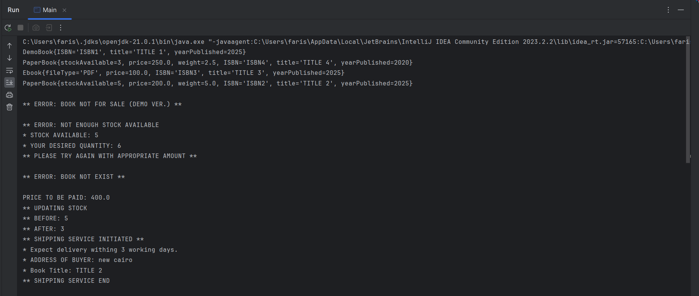
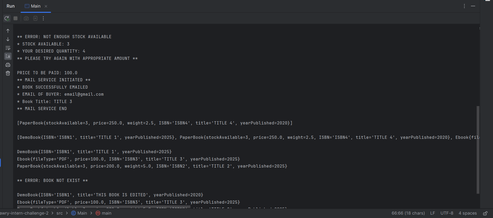
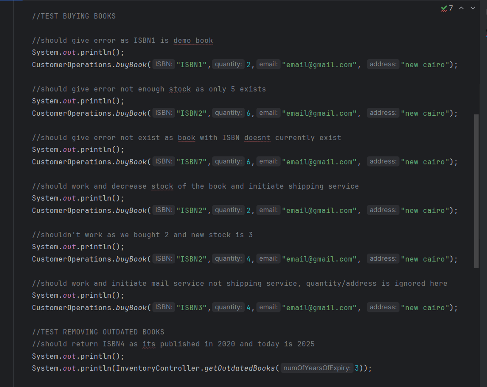
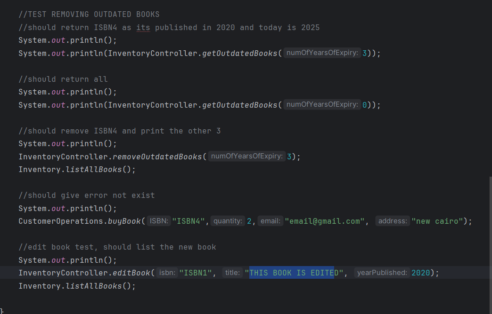

# Quantum Bookstore System

A modular online bookstore system implementing three book types with inventory management, purchase processing, and automatic removal of outdated books.

## Key Features

### Book Type Support

- **Paper Books**
  - Real-time stock tracking
  - Shipping service integration
- **EBooks**
  - Multiple file format support
  - Automated email delivery
- **Showcase Books**
  - Read-only preview mode
  - Non-purchasable by design

### Core Operations

- 📥 **Inventory Management**
  - Add/remove books by ISBN
  - Automatic outdated book detection (configurable year threshold)
- 🛒 **Purchase System**
  - Multi-format support (paper + eBook under same ISBN)
  - Validation for stock/email/address
  - Thread-safe quantity updates

---

### Architecture Highlights

- **Extensible Design**
  - New book types can be added without modifying core logic
  - Interfaces for shipping (`Shippable`), sales (`Sellable`), and mailing (`Mailable`)
- **Inventory Analytics**
  - Outdated book reporting

### 📺 Demo Video

### Screenshots

[]
[]
[]
[]

## 💻 Development Environment

This project was developed using **IntelliJ IDEA**, and it's **recommended** to run it using the same environment for best experience:

- Automatic build configuration
- Syntax highlighting and code navigation
- Easier execution of the `Main` class

---

## 📎 License

This project was developed as part of the **Fawry Rise Journey Internship Challenge** and is intended for educational and evaluative purposes.

---

## Contact  

Have feedback or want to collaborate? Feel free to connect:  

- **GitHub** – [linzi-v7](https://github.com/linzi-v7)  
- **LinkedIn** – [Faris Osama](https://www.linkedin.com/in/faris-osama-7a3496303/)  

---

### 📌 Project Status: **Submitted** 🚀
